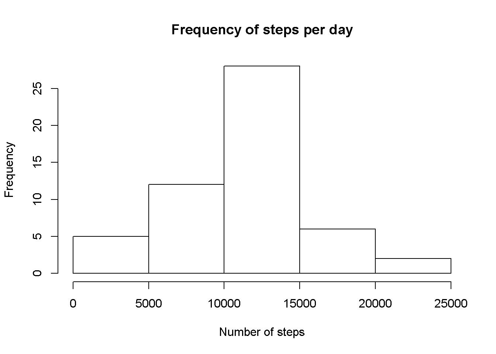
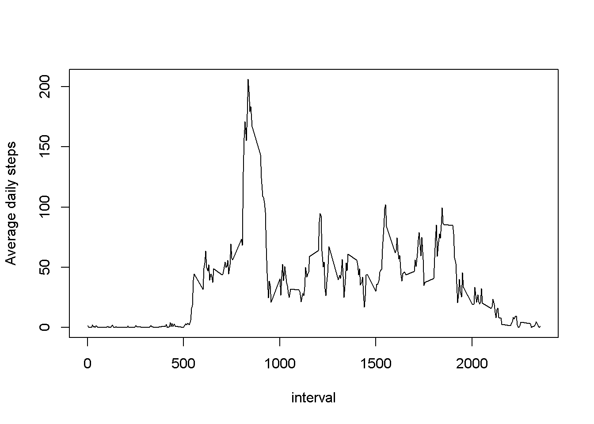
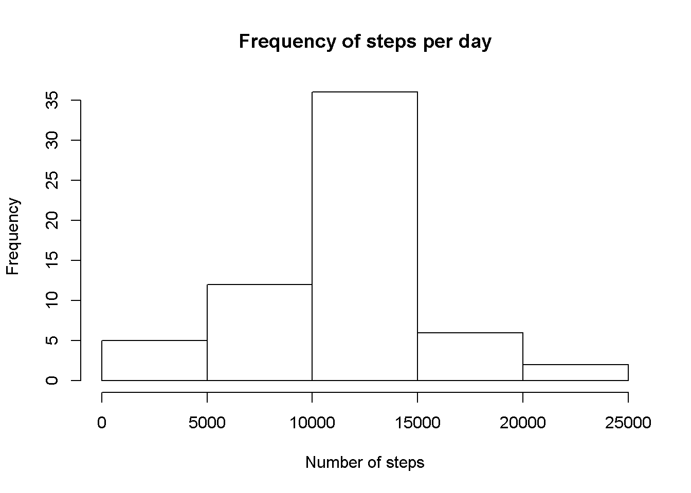
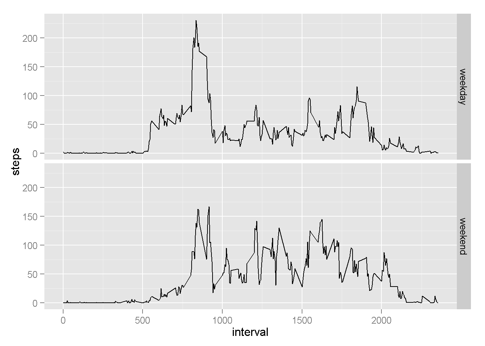

  
**Loading and preprocessing the data**  

As a precaution, I already joined the two columns related to time (date and interval) into one POSIXt column called "time". The "interval" vector can be considered as a time vector, in the format HHMM. However, all the zeros are missing, so the time "00:05" is written only as the integer "5". So I wrote a function to fill in the zeros, merged with "date" and converted the resulting column to POSIXt.It was pretty useful down the road.


```r
df=read.csv("activity.csv")
fulltime=function (xx) {
  if (nchar(xx)==1){xx=paste("000",xx,sep="")}
  else if (nchar(xx)==2){paste("00",xx,sep="")}
  else if (nchar(xx)==3){paste("0",xx,sep="")}
  else {xx}
}
df$time=sapply(df$interval,fulltime)
df$time=paste(df$date,df$time)
df$time=strptime(df$time,format="%Y-%m-%d %H%M")
str(df)
```

```
## 'data.frame':	17568 obs. of  4 variables:
##  $ steps   : int  NA NA NA NA NA NA NA NA NA NA ...
##  $ date    : Factor w/ 61 levels "2012-10-01","2012-10-02",..: 1 1 1 1 1 1 1 1 1 1 ...
##  $ interval: int  0 5 10 15 20 25 30 35 40 45 ...
##  $ time    : POSIXlt, format: "2012-10-01 00:00:00" "2012-10-01 00:05:00" ...
```
  
**What is mean total number of steps taken per day?**  

For this part of the assignment, you can ignore the missing values in the dataset.

1 - Calculate the total number of steps taken per day

```r
steps=aggregate(steps~date,data=df,sum)
steps
```

```
##          date steps
## 1  2012-10-02   126
## 2  2012-10-03 11352
## 3  2012-10-04 12116
## 4  2012-10-05 13294
## 5  2012-10-06 15420
## 6  2012-10-07 11015
## 7  2012-10-09 12811
## 8  2012-10-10  9900
## 9  2012-10-11 10304
## 10 2012-10-12 17382
## 11 2012-10-13 12426
## 12 2012-10-14 15098
## 13 2012-10-15 10139
## 14 2012-10-16 15084
## 15 2012-10-17 13452
## 16 2012-10-18 10056
## 17 2012-10-19 11829
## 18 2012-10-20 10395
## 19 2012-10-21  8821
## 20 2012-10-22 13460
## 21 2012-10-23  8918
## 22 2012-10-24  8355
## 23 2012-10-25  2492
## 24 2012-10-26  6778
## 25 2012-10-27 10119
## 26 2012-10-28 11458
## 27 2012-10-29  5018
## 28 2012-10-30  9819
## 29 2012-10-31 15414
## 30 2012-11-02 10600
## 31 2012-11-03 10571
## 32 2012-11-05 10439
## 33 2012-11-06  8334
## 34 2012-11-07 12883
## 35 2012-11-08  3219
## 36 2012-11-11 12608
## 37 2012-11-12 10765
## 38 2012-11-13  7336
## 39 2012-11-15    41
## 40 2012-11-16  5441
## 41 2012-11-17 14339
## 42 2012-11-18 15110
## 43 2012-11-19  8841
## 44 2012-11-20  4472
## 45 2012-11-21 12787
## 46 2012-11-22 20427
## 47 2012-11-23 21194
## 48 2012-11-24 14478
## 49 2012-11-25 11834
## 50 2012-11-26 11162
## 51 2012-11-27 13646
## 52 2012-11-28 10183
## 53 2012-11-29  7047
```
    

2 - Make a histogram of the total number of steps taken each day

```r
hist(steps[,2],main="Frequency of steps per day",xlab="Number of steps")
```

 

3 - Calculate and report the mean and median of the total number of steps taken per day

```r
summary(steps$steps)[3:4]
```

```
## Median   Mean 
##  10760  10770
```

**What is the average daily activity pattern?**  

1 - Make a time series plot (i.e. type = "l") of the 5-minute interval (x-axis) and the average number of steps taken, averaged across all days (y-axis)  
The "interval" vector can be considered as a time vector, in the format HHMM. However, all the zeros are missing, so the time "00:05" is written only as the integer "5". So I wrote a function to fill in the zeros, converted the column to POSIXt and made a line plot of the resulting time series.


```r
xxy=aggregate(steps~interval,data=df,mean,na.rm=T)
plot(xxy$interval,xxy$steps,type="l",xlab="interval",ylab="Average daily steps")
```

 


2 - Which 5-minute interval, on average across all the days in the dataset, contains the maximum number of steps?

```r
mean.int=tapply(df$steps,df$interval,mean,na.rm=T)
mean.int[mean.int==max(mean.int)]
```

```
##      835 
## 206.1698
```
  
  
**Imputing missing values**  

Note that there are a number of days/intervals where there are missing values (coded as NA). The presence of missing days may introduce bias into some calculations or summaries of the data.

1 - Calculate and report the total number of missing values in the dataset (i.e. the total number of rows with NAs)

```r
sum(!complete.cases(df[,1:3]))
```

```
## [1] 2304
```

2 - Devise a strategy for filling in all of the missing values in the dataset. The strategy does not need to be sophisticated. For example, you could use the mean/median for that day, or the mean for that 5-minute interval, etc.  

There appear to be a greater variability between intervals than between days, so I will use the mean of the 5-minute interval.

```r
MeanInterval=tapply(df$steps,df$interval,mean,na.rm=T)
summary(MeanInterval)
```

```
##    Min. 1st Qu.  Median    Mean 3rd Qu.    Max. 
##   0.000   2.486  34.110  37.380  52.830 206.200
```
  
3 - Create a new dataset that is equal to the original dataset but with the missing data filled in.

```r
MeanInterval=aggregate(steps~interval,data=df,mean,na.rm=T)
names(MeanInterval)=c("interval","StepsMean")
df2=merge(df,MeanInterval,by="interval")
for (i in 1:length(df2$steps)){
  if (is.na(df2$steps[i])==T) {df2$steps[i]=df2$StepsMean[i]}
  else {df2$steps[i]}
}
sum(is.na(df2$steps))
```

```
## [1] 0
```

4 - Make a histogram of the total number of steps taken each day and Calculate and report the mean and median total number of steps taken per day. Do these values differ from the estimates from the first part of the assignment? What is the impact of imputing missing data on the estimates of the total daily number of steps?


```r
steps2=aggregate(steps~date,data=df2,sum)
hist(steps2[,2],main="Frequency of steps per day",xlab="Number of steps")
```

 
Before

```r
summary(steps$steps)[3:4]
```

```
## Median   Mean 
##  10760  10770
```
After

```r
summary(steps2$steps)[3:4]
```

```
## Median   Mean 
##  10770  10770
```
  
The mean stayed the same and there was a sligth variation in the median (10 steps bigger). However, the histogram is closer to a normal shape than before.
  
  
**Are there differences in activity patterns between weekdays and weekends?**  

1 - Create a new factor variable in the dataset with two levels - "weekday" and "weekend" indicating whether a given date is a weekday or weekend day.  

Warning: this code was developed in a computer set up for the language "portugues". If your computer is in english, you should change the code below to c("Sunday","Saturday").


```r
for (i in 1:length(df2$time)){
  if (weekdays(df2$time[i]) %in% c("sábado","domingo")==TRUE) {df2$week[i]="weekend"}
  else {df2$week[i]="weekday"}
}
table(df2$week)
```

```
## 
## weekday weekend 
##   12960    4608
```

2 - Make a panel plot containing a time series plot (i.e. type = "l") of the 5-minute interval (x-axis) and the average number of steps taken, averaged across all weekday days or weekend days (y-axis). See the README file in the GitHub repository to see an example of what this plot should look like using simulated data.

```r
library(ggplot2)
df2=df2[order(df2$time),]
weeks=aggregate(steps~week+interval,data=df2,mean)
ggplot(weeks,aes(x=interval,y=steps))+geom_line()+facet_grid(week~.)
```

 

End of the assignment. Thank you for your time. :)
